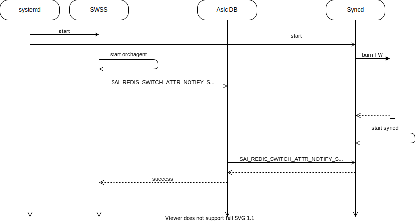

# FW Burn Init Issue
# Overview
- We have an issue in init flow when FW burn takes place.
- We can see below that SWSS Orchagent tries to configure Syncd while FW burn takes place.

__Figure 1: Issue description__

- Since the flow is valid the decision we took is to increase the timeout for Orchagent SAI Redis calls.

__Figure 2: After the fix__

# High-Level Design
- We will set the timeout of SAI Redis calls in Orchagent init flow.
- Timeout will be set to 480 seconds.
- Timeout will be set back to default (60 seconds) right after the call to SAI_REDIS_SWITCH_ATTR_NOTIFY_SYNCD since if we got response from Syncd we can know for sure it is up.
- Why 480 secondes? FW burn might take up to 7 minutes in systems with Gearbox, see below table with time measurements.

|Operation|SPC1|SPC2|SPC3|SPC2 with Gearbox
|--|--|--|--|--|
|MST start|2s|2s|2s|2s
|FW burn|1m55s|1m27s|1m32s|1m35s
|SXD start|3s|12s|42s|5m26s
|Whole process|2m|1m41s|2m16s|7m3s

# API
- This API allows us to set the timeout for SAI Redis API calls.
- Identifier: SAI_REDIS_SWITCH_ATTR_GET_RESPONSE_TIMEOUT_MS
- Value: 480 sec
